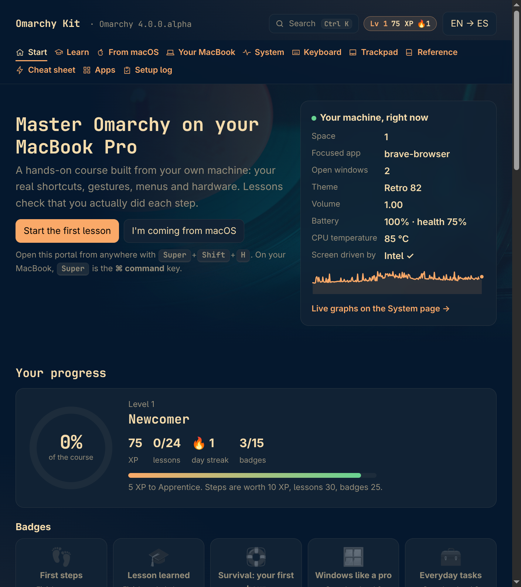
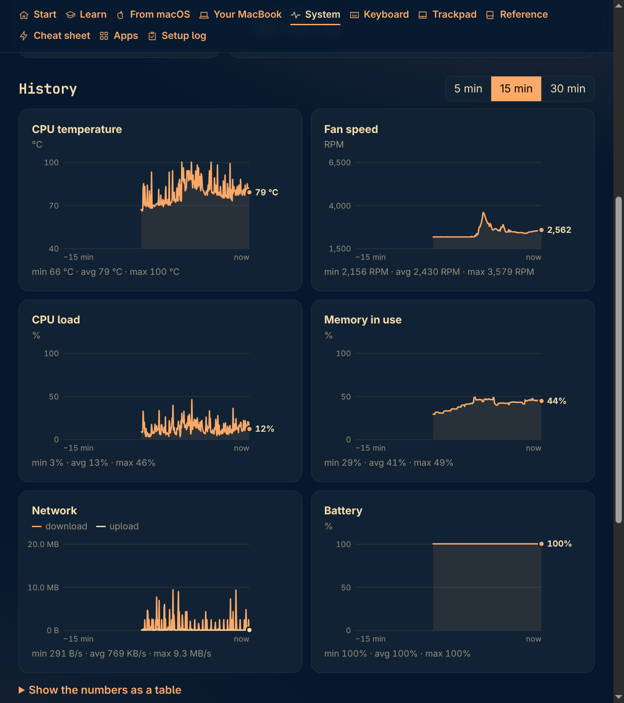
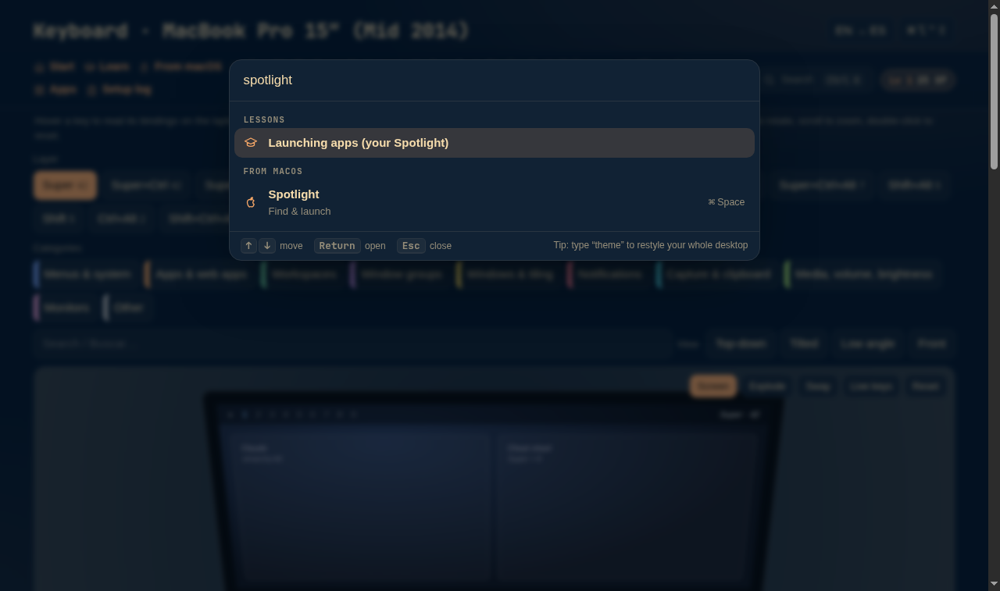

# Omarchy Kit

A bilingual (English / Español) learning portal and setup toolkit for running
[Omarchy](https://omarchy.org) on a **15" MacBook Pro, mid-2014 (MacBookPro11,3)**: Intel Haswell + NVIDIA GT 750M.

It is a small local web app (Python standard library only, no build tools) that teaches Omarchy using your own
machine's real shortcuts, gestures, menus and hardware, and checks live that you actually did each step.



## What's inside

| Page | What it does |
|---|---|
| **Start** | Your progress (XP, levels, streak, 15 badges), a live machine panel, and a gallery to switch the Omarchy theme |
| **Learn** | 25 hands-on lessons, verified live against Hyprland (opening windows, switching spaces, the scratchpad…) |
| **From macOS** | "How do I…?" for 50 Mac habits, translated to the shortcuts on *this* system |
| **Your MacBook** | What works on 2014 MacBook hardware, with live readings and fixes |
| **System** | Live graphs (2 s samples, 30 min history) of CPU temperature, fans, load, memory, network and battery, plus the busiest apps |
| **Games** | Retro library status per console, disk budget, BIOS checklist, PS4 controller battery and hotkeys |
| **Keyboard / Trackpad** | Interactive 3D models of the MacBook keyboard and trackpad, showing every binding and gesture |
| **Reference / Cheat sheet** | All Omarchy commands, the full menu tree, and a glossary, read from the installed Omarchy |
| **Apps** | One-click installer for the apps in `apps.toml` |
| **Setup log** | Every change made to the machine, how to undo it, and its live status |

Across every page:

- **Follows your Omarchy theme.** Colors and font come from the current theme and update the moment you switch themes.
- **Ctrl+K command palette.** Search pages, lessons, shortcuts, Mac translations, apps, menu items, commands and themes from anywhere.
- **Gamified progress.** XP, ranks, a daily streak, badges with toasts, and confetti when you finish a lesson (skipped when reduced motion is on).




## MacBook Pro 2014 fixes included

- `gpu/`: keep the hot NVIDIA GT 750M **off** (`nvidia-off.service`) and the panel on Intel. Fans dropped from about 5,900 to about 2,200 RPM.
- `audio/`: a measured speaker EQ in Omarchy's speaker-tuning layout, automatically bypassed for headphones.
- The Setup log documents each change with its undo command.

## Making it feel like a Mac

For someone coming from macOS, on top of the gestures and top row the kit sets up:

- **Accents like macOS.** `kb_variant = "mac"` (in `~/.config/hypr/input.lua`) makes the right Option key a dead-key
  accent key: ⌥e then a gives á, ⌥n then n gives ñ, ⌥1 gives ¡, ⌥⇧/ gives ¿. The left Option stays Alt, so Hyprland's Alt
  shortcuts are untouched. fcitx5 copies the layout only when it starts: after changing it run
  `systemctl --user restart omarchy-fcitx5`.
- **⌘ shortcuts inside apps** (`keys/`): `mackeys.lua` turns Super+A, Z, ⇧Z, R, ⇧R, N, ⇧T, D, B, I, U, [ and ] into the
  Ctrl chord the app expects, skipping terminals. It only uses keys Omarchy leaves free (Super+W/T/F/S/L/P/G keep their
  Omarchy meaning). `keys/install-mackeys` installs it and `--remove` undoes it; `test/verify-mackeys.mjs` checks every
  shortcut against a real Brave window.
- **Three fingers: your choice.** They switch spaces by default; `trackpad/three-fingers drag` turns them into a
  three-finger drag (select and drag without clicking) with spaces on four fingers, as on a Mac that uses it.
  libinput cannot do both, and macOS makes the same trade-off.
- **Power profile follows the charger** (`power/`): Performance when plugged in, Balanced on battery, no root needed.
- **Menu-bar clock with the date, and Auto appearance** (`appearance/`, off until you turn it on): light theme by day,
  dark at night, switching only when the period changes so a hand-picked theme sticks.
- **Opt-in ⌘W ⌘T ⌘F ⌘S ⌘L ⌘G ⌘P** (`keys/mac-key-extras`): Omarchy already uses those Super keys, so you choose key by key;
  terminals always keep the Omarchy meaning.
- **A Time Machine for your files** (`backup/install-backups`, needs sudo): hourly `/home` snapshots with snapper plus
  Pika Backup for the real backup. Preview with `--dry-run`.
- **Where your battery goes** (`power/power-lab`, `docs/POWER-LAB.md`): measures the real draw, the CPU package and its sleep states
  with the display on and off, and tries power-saving changes one at a time or cumulatively, reverting each straight after. It runs
  as a background service so the terminal stays idle (a busy terminal adds about 4 W). The first tuning it produced is
  `power/install-wifi-powersave` (about 0.9 W, `--remove` undoes it). `power/msr-probe` is a read-only check of the CPU's package
  C-state limit.
- **Sleep that you can trust** (`sleep/`): this MacBook's deep sleep does not wake when the lid opens, so light sleep
  (s2idle) is set at every boot (`install-s2idle`); hibernate works and stays off (`install-hibernate-mode`), asks one
  password instead of two (`install-hibernate-nolock`, no root) and `install-battery-log` records what each sleep costs.
  Every installer takes `--remove`. `sleep-check` reads the journal and tells you whether closing the lid really
  suspended and resumed, in which mode, how much battery it used, and lists hibernates.

The full list, with how each piece was verified, the open decision and what is still waiting for a person, is in
[docs/MAC-FEEL.md](docs/MAC-FEEL.md).

These scripts are written for MacBookPro11,3. `gpu/nvidia-off` and `gpu/switch-to-intel` refuse to run on any other model; read the rest before running them on another machine.

## Retro gaming

RetroArch (installed with Omarchy's own installer), tuned from benchmarks on this machine at 2880×1800:

- **OpenGL instead of Vulkan:** Mesa reports Haswell Vulkan as incomplete.
- **CRT filters chosen by measured fps:** Omarchy's default crt-royale ran at 45 fps (games need 60). The global
  filter is zfast-crt (558 fps), 2D consoles use crt-hyllian-fast (272 fps), and handhelds get LCD filters.
- **Low latency:** 2D consoles use one frame of run-ahead plus rewind. Cave Story (Mega Drive) still runs at
  202 fps with everything on.
- **3D consoles:** PlayStation at 2× with PGXP, N64 with GLideN64 at 960×720, Dreamcast at 1280×960.
- **GameCube:** standalone Dolphin (`kit-games dolphin`): OpenGL, 2× (1280×1056), hybrid ubershaders. It holds
  60 fps with 0.1% late frames in fullscreen (Retro League GX homebrew). The RetroArch core can't compile shaders
  in the background here, so ES-DE launches GameCube games with standalone Dolphin.
- **PS4 controller:** PS opens the menu; hold Share with R1/L1 to save/load a state, R2 to fast-forward,
  L2 to rewind, and Options to quit.

`games/kit-games` manages the library in `~/Games/roms/<console>`. Your own dumps go there, named the
No-Intro/Redump way. It builds one playlist per console pinned to the right core, downloads box art from
libretro's thumbnail server, fetches Dolphin's open-source `Sys` folder for GameCube, checks BIOS files, and
keeps the library within a budget of half the free disk. Consoles, cores and the space plan are in
`games/systems.toml`.

Free games to start with, all from their official sources:

- `games/fetch-homebrew` installs the best-ranked finished homebrew from [Homebrew Hub](https://hh.gbdev.io):
  100 Game Boy, 100 Game Boy Color, 100 GBA and 18 NES games, with cover art and author credits.
- `games/fetch-freeware` installs 12 ScummVM freeware adventures (Beneath a Steel Sky, Flight of the Amazon
  Queen, Broken Sword 2.5 and more), the 20 arcade ROMs MAME distributes with their owners' permission, and
  open-source GameCube homebrew (Retro League GX, Super Methane Brothers) with credits.

Games you own: dump them yourself and run `kit-games ingest`. [docs/DUMPING-GUIDE.md](docs/DUMPING-GUIDE.md) lists the
right tool per console (GB Operator, OSCR, redumper, CleanRip, DreamShell) with steps.

A store client reads a **signed catalog snapshot** that a publisher hosts: `kit-games store refresh --from <folder or
https address>` fetches it and trusts it only if the checksum matches, the ECDSA P-256 signature verifies with a publisher
public key you saved in `~/.config/omarchy-kit/store-publisher.pem` (never trust-on-first-use), and the version is newer than
yours. `list`, `search` and `info` browse it, `get` installs free games (checked against the library budget and the catalog's
checksums, with license and credit shown), `remove` and `sync` take them out again (saves are kept), and commercial games
appear only as guides, never as files. Nothing is uploaded. Built and tested; not yet run on this machine's real library
(no publisher key here). **Your own backups:** `store locations add <folder>` registers a folder that holds backups of games you
own, `store scan` recognises its files on this machine against the libretro databases RetroArch already uses (nothing is
sent anywhere), and a commercial catalog entry you hold a recognised copy of shows *In your backups* and installs from your
folder with `store get`. Locations and the results are local files that cannot be exported or shared. Built and tested; not
yet run on a real backup folder. Still planned: a `/store` page. See [docs/GAME-STORE-ROADMAP.md](docs/GAME-STORE-ROADMAP.md).

```bash
games/kit-games init     # folders, budget, Dolphin Sys data
games/kit-games scan     # playlists
games/kit-games art      # box art, screenshots, title screens
games/kit-games budget   # space per console vs. the plan
games/kit-games bios     # which BIOS files are present
games/kit-games ingest   # identify your own dumps in ~/Games/inbox, rename, compress (CHD/RVZ), file them
games/kit-games esde     # ES-DE frontend over the library (official AppImage in ~/.local/opt/es-de)
games/kit-games cabinet  # RetroFE config (RetroFE 0.10.31 renders black on Hyprland/Mesa 26; ES-DE is the frontend)
games/kit-games export-telesia [--upload]   # library + playtime for Telesia's RetroArch import
games/kit-games store refresh --from SOURCE # fetch, verify (pinned publisher key) and install a signed catalog snapshot
games/kit-games store list|search|info|get|remove|sync|health   # browse it, install free games, withdraw tombstoned ones
games/kit-games store locations add|list|remove, store scan|backups   # your own backups: recognised locally, installed from your folder
```

## Run it

```bash
git clone https://github.com/aldoruizluna/omarchy-kit ~/labspace/omarchy-kit
cd ~/labspace/omarchy-kit
python3 build_cheatsheet.py        # builds every page from your live Omarchy install
./apps-helper                      # serves http://127.0.0.1:8787 and opens it
```

To start it with your session, install the user service:

```bash
mkdir -p ~/.config/systemd/user && cp omarchy-kit.service ~/.config/systemd/user/
systemctl --user enable --now omarchy-kit
```

The service only listens on `127.0.0.1`. The endpoints that act on your desktop (open a menu, switch theme,
install apps) require a per-run token embedded in the served pages, and the `Host` header is checked to block DNS
rebinding.

Optional personal details, such as a co-admin's name on the Setup log, go in a git-ignored `local.toml`:

```toml
[coadmin]
name = "Full Name"
user = "username"
```

## Tests

```bash
node test/verify-portal.mjs      # all pages, lessons engine, palette, System page
node test/verify-keyboard.mjs
node test/verify-trackpad.mjs
python3 test/test_store.py        # store client: signatures, rollback, checksums, tombstones (stdlib + openssl, no network)
python3 test/test_personal.py     # your own backups: locations, .rdb reader, scan, merge, install (sockets blocked)
node test/verify-store-page.mjs  # the Games page's store section in EN and ES, served from this checkout
CDP_ATTACH=9334 node test/verify-portal.mjs   # drive a real, GPU-accelerated Brave instead of headless Chromium
```

The tests drive Chromium over the DevTools protocol with no npm dependencies (Node 22+). They never apply themes
or open the real Omarchy menu.

---

**Español:** Omarchy Kit es un portal de aprendizaje bilingüe y un kit de configuración para usar Omarchy en una
MacBook Pro de 15" de mediados de 2014. Enseña con tus atajos, gestos y hardware reales, verifica cada paso en vivo,
sigue tu tema de Omarchy, y trae gráficas del sistema, búsqueda con Ctrl+K e insignias. Licencia MIT.
