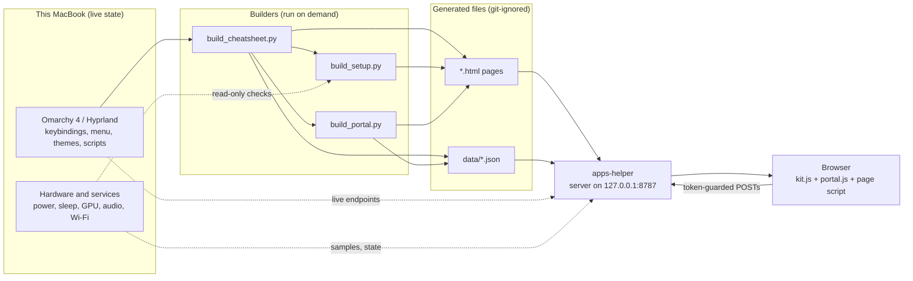

# Architecture: how Omarchy Kit fits together

> **TL;DR.** Omarchy Kit is a small local web app plus a set of reversible setup scripts. Python builders turn this machine's *live*
> Omarchy state into static HTML pages; a Python standard-library server (`apps-helper`, on `127.0.0.1:8787`) serves them and a few
> read-only JSON endpoints; a shared browser script (`kit.js`) adds the theme, search, progress and accessibility features. The
> scripts in the topic folders (`sleep/`, `power/`, `themes/` ...) change the machine; every one is idempotent and undoable, and
> the Setup log page reports their live status.

Related: [INDEX](INDEX.md) · [DEVELOPING](DEVELOPING.md) · [GLOSSARY](GLOSSARY.md) · [FIELD-NOTES](FIELD-NOTES.md) · [README](../README.md)

## The big picture

Nothing in the pages is hard-coded about *your* machine: shortcuts are looked up from Omarchy's own binding descriptions, commands are
read from the headers of Omarchy's scripts, the menu tree from Omarchy's menu definition, and every status line is checked when the
page is built (or, for the Setup log, on each visit). A shortcut the content names but the system lacks is reported as "not bound"
instead of being invented.

## The build chain

`python3 build_cheatsheet.py` is the single entry point; it calls the others in order.

| Step | Script | Reads | Writes |
|---|---|---|---|
| 1 | `build_cheatsheet.py` | `omarchy menu keybindings --print` (or `bindings.snapshot.txt`), `/sys/module/hid_apple/parameters/fnmode`, `kitconf.py` | `bindings.snapshot.txt`, `data/bindings.json`, `cheatsheet.html`, `keyboard.html`, `trackpad.html` |
| 2 | `build_setup.py` | the live system (`checks()`), its own records (`STATUS`, `LOG`, `ISSUES`, `TODO`, `SKIPPED`), `setup.template.html` | `setup.html` |
| 3 | `build_portal.py` | `data/bindings.json`, Omarchy's scripts and menu, `portal_lessons.py`, `portal_content.py`, `apps.toml` | `index.html`, `learn.html`, `mac.html`, `macbook.html`, `reference.html`, `system.html`, `games.html`, `data/menu_ids.json`, `data/kit-index.json` |
| - | `build_apps_page.py` | `apps.toml` | `apps.html` (copy-only mode; the server renders `/apps` live) |

Each page has a `*.template.html` with a placeholder such as `/*__PORTAL__*/{}` or `/*__DATA__*/[]` that the builder replaces with a JSON
blob. All built `*.html` files and `data/` are git-ignored: they hold this machine's details, and rebuilding is one command.

## The server: `apps-helper`

A `ThreadingHTTPServer` bound to `127.0.0.1:8787`, started by the user unit `omarchy-kit.service`. It imports `kitlive.py`
(live theme CSS, a background hardware sampler that keeps about 30 minutes of history) and `appslib.py`.

| Kind | Routes | Notes |
|---|---|---|
| Pages | `/`, `/learn`, `/mac`, `/macbook`, `/reference`, `/cheatsheet`, `/keyboard`, `/trackpad`, `/system`, `/games` | served from the built files |
| Live pages | `/setup`, `/apps` | `/setup` re-runs the checks on every visit and never writes into the repository; `/apps` renders `apps.toml` |
| Assets | `/portal.css`, `/portal.js`, `/portal-nav.js`, `/kit.css`, `/kit.js`, `/data/kit-index.json`, `/theme.css`, `/wallpaper`, `/favicon.ico` | `/wallpaper` is the current Omarchy background scaled to 1920 px and cached in `~/.cache/omarchy-kit` |
| Read-only JSON | `/api/state`, `/api/hw`, `/api/live[?since=<t>&snap=0]`, `/api/theme`, `/api/games`, `/api/top`, `/status` | `/api/state` is what the lessons use to check that you really did a step |
| Actions (POST) | `/api/menu`, `/api/theme`, `/install`, `/api/games/scan`, `/api/games/ingest`, `/api/games/export-telesia` | need the per-run token; long games jobs run one at a time |

**Security model.** Loopback only. The `Host` header must be `127.0.0.1:8787` or `localhost:8787` (blocks DNS rebinding). Every POST
needs the token that the server embeds in the pages it serves, compared in constant time. Actions only accept values from known lists
(menu routes from the live menu, theme names from the installed themes, app ids from `apps.toml`), and app ids reach the install script
as arguments, never as shell text. The pages never contain passwords or passphrases.

**Gotcha.** The service imports `build_setup` once and keeps it in memory. After editing any Python file, run
`systemctl --user restart omarchy-kit`, or a rebuilt page shows the old checks.

## The browser side

| File | Role |
|---|---|
| `kit.js` | on every page: live Omarchy theme, Ctrl+K palette (reads `data/kit-index.json`), XP, ranks, streaks and badges (in `localStorage`), toasts and confetti, a skip link and a `main` landmark |
| `kit.css` | shared look, palette, toasts, skip link, print styles |
| `portal.js`, `portal-nav.js`, `portal.css` | language switch (EN/ES via `data-en` / `data-es` attributes), the shared 12-link navigation, base styles |
| `*.template.html` | one page each, with its own script |
| `theme.css` | static fallback; the server replaces it live from the current Omarchy theme |

`kitlive.theme_css()` maps the Omarchy theme palette onto the CSS variables the pages use, and makes muted text, links and status colours
readable on every surface they can sit on (page, card, keycap chip, highlighted row).

## The learning engine

`portal_lessons.py` holds six levels of lessons. Each step names the shortcut it teaches by Omarchy's own *binding description*
(`"k"`), which `build_portal.py` resolves to your current keys, and a `check` that `learn.template.html` verifies against `/api/state`:
`newWindow`, `closeWindow`, `wsIs`, `wsChange`, `moved`, `floating`, `fullscreen`, `special`, `toSpecial`, `focusChange`, `grouped`,
`themeChanged`, `volumeChanged`, `newShot`, `typed` (a pattern typed into a box) or `manual`. Checks are *edge-triggered*: the goal has
to be false at some point after the step starts, so a state you were already in does not tick it by itself. `portal_content.py` holds
the macOS-habit translations, the glossary and the hardware cards. Everything is bilingual; the tests fail on a missing translation.

## The Setup log

`build_setup.py` is both the machine's handbook and its live health check.

- `checks()` returns `{key: (status, english[, spanish])}` for every row, where status is `ok`, `action`, `pending` or `info`; a third element
  is the Spanish text (identifier-only details stay English).
- `STATUS` lists the rows (key, titles, what to do, the command) in groups; `LOG` records every change with its undo; `ISSUES`, `TODO`
  and `SKIPPED` hold known problems, open items by owner, and ideas deliberately not done.
- The template shows a reading guide, the four status colours, and a language switch.

Rule: **every change to the machine gets a record with its undo command here.**

## The scripts that change the machine

Each topic folder has its own README; all installers share one contract.

| Folder | Topic | README |
|---|---|---|
| `sleep/` | lid wake (light sleep), hibernate that stays off, one password, battery log | [sleep/README.md](../sleep/README.md) |
| `power/` | power profile follows the charger, Wi-Fi power saving, the power lab | [power/README.md](../power/README.md) |
| `themes/` | six original themes with generated wallpapers | [themes/README.md](../themes/README.md) |
| `gpu/` | keep the NVIDIA GPU off, firmware boot GPU | [gpu/README.md](../gpu/README.md) |
| `audio/` | speaker EQ and the headphone watcher | [audio/README.md](../audio/README.md) |
| `keys/`, `trackpad/` | Mac ⌘ shortcuts, three-finger behaviour | [keys/README.md](../keys/README.md), [trackpad/README.md](../trackpad/README.md) |
| `appearance/` | light by day, dark at night | [appearance/README.md](../appearance/README.md) |
| `backup/`, `boot/` | snapshots and Pika Backup, a faster themed boot | [backup/README.md](../backup/README.md), [boot/README.md](../boot/README.md) |
| `games/` | retro library, free games, a signed catalog client | [games/README.md](../games/README.md) |

**The installer contract:** idempotent (running twice changes nothing more); `--remove` undoes it; `--help` prints usage and an unknown
option exits 2 *without installing*; scripts that need root say so and the owner runs them with `sudo`; scripts that lower a security
control are never run by an assistant; every one fails closed. Details and rules: [DEVELOPING](DEVELOPING.md) and
[FIELD-NOTES](FIELD-NOTES.md).

## Where state lives

| Place | What | In git? |
|---|---|---|
| `local.toml` | optional personal details (a co-admin's name) | no |
| `data/` | generated JSON and power-lab results | no |
| built `*.html` | the pages | no |
| `~/.config/omarchy-kit/` | the user's choices (⌘ extras, power-auto, appearance, store keys and locations) | outside the repo |
| `~/.local/share/omarchy-kit/sleep-lock-shim/` | the hibernate no-lock shim | outside the repo |
| `~/.cache/omarchy-kit/` | the scaled wallpaper | outside the repo |
| `~/Games/` | the retro library | outside the repo |

## Tests

`test/run-all` runs a syntax lint, the hermetic Python tests (temporary directories, fake commands, no root, no network), then the browser
suites against the running portal. Every headless browser takes its own free debugging port. See [test/README.md](../test/README.md).

---

Related: [INDEX](INDEX.md) · [DEVELOPING](DEVELOPING.md) · [GLOSSARY](GLOSSARY.md) · [SLEEP](SLEEP.md) · [POWER-LAB](POWER-LAB.md) · [THEMES](THEMES.md) · [MAC-FEEL](MAC-FEEL.md) · [FIELD-NOTES](FIELD-NOTES.md)
