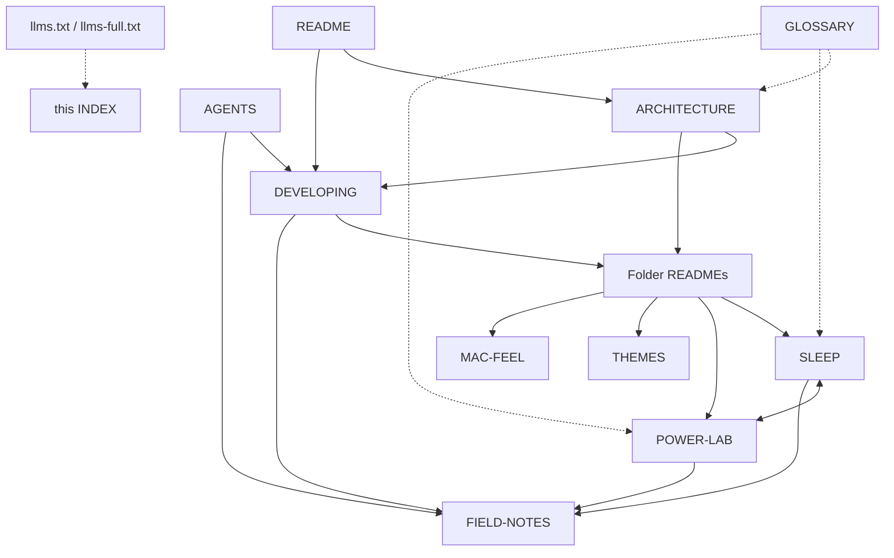

# Documentation map

> **TL;DR.** Every document in this repository, what it is for, and which to read first. Start with the row that matches what you want to do. Each document
> opens with a TL;DR and closes with a **Related** line, so you can always step to the next relevant one. Tools and assistants: start at
> [llms.txt](../llms.txt) (the index) or [llms-full.txt](../llms-full.txt) (the whole documentation in one file), and read [AGENTS.md](../AGENTS.md) before changing anything.

Related: [README](../README.md) · [ARCHITECTURE](ARCHITECTURE.md) · [DEVELOPING](DEVELOPING.md) · [GLOSSARY](GLOSSARY.md) · [AGENTS](../AGENTS.md)

## I want to ...

| I want to ... | Read |
|---|---|
| understand what this project is and try it | [README](../README.md) |
| see how the pieces fit | [ARCHITECTURE](ARCHITECTURE.md) |
| change or add something | [DEVELOPING](DEVELOPING.md), then the README of the folder you are changing |
| work on it as an AI coding assistant | [AGENTS](../AGENTS.md), then [FIELD-NOTES](FIELD-NOTES.md) |
| fix closing the lid, sleep or hibernate | [SLEEP](SLEEP.md), [sleep/README](../sleep/README.md) |
| find where the battery goes, or save power | [POWER-LAB](POWER-LAB.md), [power/README](../power/README.md) |
| feel like on a Mac (keys, accents, gestures) | [MAC-FEEL](MAC-FEEL.md), [keys/README](../keys/README.md), [trackpad/README](../trackpad/README.md) |
| use or change the themes | [THEMES](THEMES.md), [themes/README](../themes/README.md) |
| keep the NVIDIA GPU off and the fans quiet | [gpu/README](../gpu/README.md), [FIELD-NOTES](FIELD-NOTES.md) |
| set up retro games | [README: Retro gaming](../README.md#retro-gaming), [games/README](../games/README.md), [DUMPING-GUIDE](DUMPING-GUIDE.md), [GAME-STORE-ROADMAP](GAME-STORE-ROADMAP.md) |
| look up a term | [GLOSSARY](GLOSSARY.md) |
| run the tests | [test/README](../test/README.md), [DEVELOPING](DEVELOPING.md#tests) |
| learn what not to do on this machine | [FIELD-NOTES](FIELD-NOTES.md) |

## All documents

| Document | Kind | What it holds | Read when |
|---|---|---|---|
| [README](../README.md) | overview | what it is, quick start, requirements, safety, the pages, the Mac fixes, retro gaming, configuration, tests, licence | first |
| [ARCHITECTURE](ARCHITECTURE.md) | explanation | build chain, server routes and security model, browser files, lesson engine, Setup log, state locations | before changing code |
| [DEVELOPING](DEVELOPING.md) | how-to | setup, the edit loop, conventions, recipes (lesson, habit, Setup row, installer, theme, document), commits | before a change |
| [AGENTS](../AGENTS.md) | contract | rules and a map for AI coding assistants | before an assistant edits anything |
| [SLEEP](SLEEP.md) | explanation + log | the lid, sleep and hibernate: measurements, what is installed, trade-offs, the open decision | sleep problems |
| [POWER-LAB](POWER-LAB.md) | explanation + log | where the 20 W goes, what was tried, what was ruled out, how to use the tool | battery questions |
| [MAC-FEEL](MAC-FEEL.md) | log | everything done to feel like a Mac, how it was verified, how to undo, what waits for a person | before changing input or gestures |
| [THEMES](THEMES.md) | explanation | the six themes, their inspiration chain, how to try them, licence and decisions | theme work |
| [FIELD-NOTES](FIELD-NOTES.md) | rules | short, checkable rules learned the hard way | before touching the machine |
| [GLOSSARY](GLOSSARY.md) | reference | one definition per term, with links | any unfamiliar term |
| [DUMPING-GUIDE](DUMPING-GUIDE.md) | how-to | dumping your own games, tool per console | retro library |
| [GAME-STORE-ROADMAP](GAME-STORE-ROADMAP.md) | design | the signed-catalog store: what is built, what is planned | store work |
| folder READMEs: [sleep](../sleep/README.md), [power](../power/README.md), [themes](../themes/README.md), [gpu](../gpu/README.md), [audio](../audio/README.md), [keys](../keys/README.md), [trackpad](../trackpad/README.md), [appearance](../appearance/README.md), [backup](../backup/README.md), [boot](../boot/README.md), [games](../games/README.md), [test](../test/README.md) | reference | what each folder's scripts do, how to use and undo them, how they are checked | working in that folder |
| `themes/*/THEME.md` | explanation | one theme's palette rationale, contrast table, credits | that theme |
| [llms.txt](../llms.txt), [llms-full.txt](../llms-full.txt) | machine index | the documentation for language models: an index and a single-file copy | tools |

## How they connect

Reading paths: **newcomer** README, then the Setup log page in the app, then the folder README you care about. **maintainer** README, ARCHITECTURE, DEVELOPING, FIELD-NOTES.
**assistant** AGENTS, DEVELOPING, FIELD-NOTES, then the doc for the topic.

## How the documentation is kept honest

- `test/test_docs.py` fails when a relative link or anchor is broken, a document is missing from this map or from `llms.txt`, `llms-full.txt` is out of date, a
  README count (lessons, badges, habits) disagrees with the code, or a document lacks its TL;DR or Related line. With `KIT_PRIVATE_NAMES=name1,name2` in the environment it also fails
  if a document names a private project (the names are not written into this public repository).
- `python3 scripts/build-llms` regenerates `llms-full.txt` after any documentation change.
- The app's Setup log is the live record: every change to the machine appears there with its undo command, in English and Spanish.
- The kit is public: documents never name private projects or contain personal details ([DEVELOPING](DEVELOPING.md#conventions-the-rules-every-change-follows)).

---

Related: [README](../README.md) · [ARCHITECTURE](ARCHITECTURE.md) · [DEVELOPING](DEVELOPING.md) · [GLOSSARY](GLOSSARY.md) · [AGENTS](../AGENTS.md) · [llms.txt](../llms.txt)
